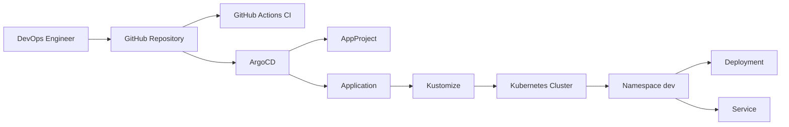
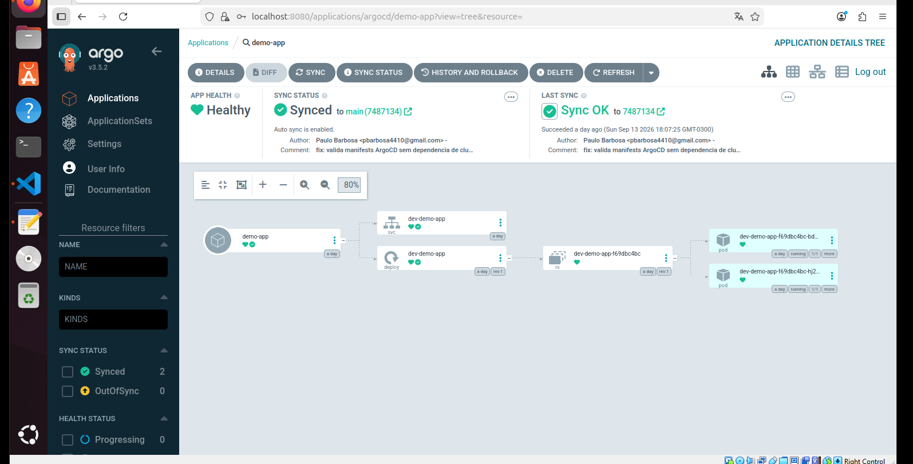

# GitOps ArgoCD Kubernetes

Projeto de portfólio que demonstra uma estratégia GitOps utilizando ArgoCD, Kubernetes, Kustomize, Helm e GitHub Actions.

O projeto implementa uma arquitetura declarativa na qual o Git atua como fonte única da verdade e o ArgoCD é responsável por manter o estado do cluster sincronizado com o estado definido no repositório.

---

## Objetivo

Demonstrar competências em:

- GitOps;
- ArgoCD;
- Kubernetes;
- Kustomize;
- Helm;
- Continuous Delivery;
- GitHub Actions;
- Infrastructure Automation;
- configuração declarativa;
- self-healing;
- drift detection;
- reconciliação contínua;
- CI/CD.

---

## Arquitetura



---

## Fluxo GitOps

```text
Código
   |
   v
Git Commit
   |
   v
GitHub
   |
   +-------------------+
   |                   |
   v                   v
GitHub Actions       ArgoCD
   |                   |
   v                   v
Validação          Reconciliação
                       |
                       v
                 Kubernetes
```

O GitHub Actions executa as validações.

O ArgoCD é responsável pelo Continuous Delivery.

---

## Estrutura

```text
gitops-argocd-kubernetes/
├── .github/
│   └── workflows/
│       └── ci.yml
│
├── argocd/
│   ├── applications/
│   │   └── demo-app.yaml
│   └── projects/
│       └── dev-project.yaml
│
├── apps/
│   └── demo/
│       ├── base/
│       │   ├── deployment.yaml
│       │   ├── service.yaml
│       │   └── kustomization.yaml
│       │
│       └── overlays/
│           └── dev/
│               └── kustomization.yaml
│
├── helm/
│   └── demo/
│       ├── templates/
│       │   ├── deployment.yaml
│       │   └── service.yaml
│       ├── Chart.yaml
│       └── values.yaml
│
├── docs/
│   ├── images/
│   │   └── argocd-synced-healthy.png
│   └── architecture.md
│
├── .gitignore
├── Makefile
└── README.md
```

---

## Kubernetes

A aplicação de demonstração utiliza:

```text
nginx:1.27-alpine
```

O Deployment possui:

- 2 réplicas;
- readiness probe;
- liveness probe;
- CPU requests;
- memory requests;
- CPU limits;
- memory limits.

O Service é do tipo:

```text
ClusterIP
```

---

## Kustomize

O projeto utiliza uma estrutura de base e overlays:

```text
apps/demo/
├── base/
└── overlays/
    └── dev/
```

A base contém os recursos comuns.

O overlay `dev` adiciona configurações específicas do ambiente.

---

## Ambiente DEV

O overlay utiliza:

```text
namespace: dev
namePrefix: dev-
environment: dev
```

Renderização:

```bash
kubectl kustomize apps/demo/overlays/dev
```

Ou:

```bash
make kustomize-dev
```

---

## Helm

O projeto também contém um Helm Chart equivalente à aplicação de demonstração.

Estrutura:

```text
helm/demo/
├── templates/
│   ├── deployment.yaml
│   └── service.yaml
├── Chart.yaml
└── values.yaml
```

Validar:

```bash
helm lint helm/demo
```

Ou:

```bash
make helm-lint
```

Renderizar:

```bash
helm template demo helm/demo
```

Ou:

```bash
make helm-template
```

---

## ArgoCD

A configuração do ArgoCD está em:

```text
argocd/
├── applications/
└── projects/
```

---

## AppProject

O arquivo:

```text
argocd/projects/dev-project.yaml
```

define um projeto ArgoCD para o ambiente de desenvolvimento.

O AppProject controla:

- repositórios permitidos;
- clusters de destino;
- namespaces permitidos;
- recursos autorizados.

---

## Application

O arquivo:

```text
argocd/applications/demo-app.yaml
```

define a aplicação monitorada pelo ArgoCD.

O ArgoCD monitora:

```text
Branch: main
Path: apps/demo/overlays/dev
```

Destino:

```text
Cluster: https://kubernetes.default.svc
Namespace: dev
```

---

## Sincronização automática

A Application possui:

```yaml
automated:
  prune: true
  selfHeal: true
```

### Self Heal

Se alguém modificar manualmente um recurso no cluster, o ArgoCD pode restaurar o estado definido no Git.

### Prune

Se um recurso for removido do Git, o ArgoCD pode removê-lo do cluster.

---

## Git como fonte única da verdade

Neste modelo:

```text
Git = Desired State
```

O cluster representa:

```text
Actual State
```

O ArgoCD compara continuamente:

```text
Desired State
     VS
Actual State
```

Quando ocorre diferença:

```text
OutOfSync
```

Após a reconciliação:

```text
Synced
```

---

## GitHub Actions

O pipeline está localizado em:

```text
.github/workflows/ci.yml
```

São executados três jobs:

```text
Validar Kustomize
Validar Helm
Validar ArgoCD
```

---

## CI — Kustomize

O pipeline renderiza:

```bash
kubectl kustomize apps/demo/base
```

e:

```bash
kubectl kustomize apps/demo/overlays/dev
```

---

## CI — Helm

O pipeline executa:

```bash
helm lint helm/demo
```

e:

```bash
helm template demo helm/demo
```

---

## CI — ArgoCD

Os manifests ArgoCD são validados de forma offline no pipeline.

O CI verifica:

- `apiVersion`;
- `kind`;
- metadata;
- projeto;
- repositório;
- branch;
- path;
- namespace;
- política de sincronização;
- `prune`;
- `selfHeal`.

Essa abordagem evita dependência de um cluster Kubernetes dentro do GitHub Actions.

---

## CI e CD

O projeto separa CI de CD.

### CI

Executado pelo GitHub Actions:

```text
Kustomize validation
Helm validation
ArgoCD manifest validation
```

### CD

Executado pelo ArgoCD:

```text
Git monitoring
Synchronization
Self-healing
Pruning
Deployment
```

Essa separação é uma característica importante de uma estratégia GitOps.

---

## Makefile

Comandos disponíveis:

```text
make kustomize-base
make kustomize-dev
make helm-lint
make helm-template
make argocd-validate
make validate
```

Para executar todas as validações:

```bash
make validate
```

---

## Requisitos

Ferramentas recomendadas:

```text
Git
kubectl
Helm
Make
Kubernetes
ArgoCD
```

Verifique:

```bash
git --version
kubectl version --client
helm version
make --version
```

---

## Instalando o ArgoCD em um cluster

Crie o namespace:

```bash
kubectl create namespace argocd
```

Instale o ArgoCD:

```bash
kubectl apply -n argocd \
  --server-side \
  --force-conflicts \
  -f https://raw.githubusercontent.com/argoproj/argo-cd/stable/manifests/install.yaml
```

Depois valide:

```bash
kubectl get pods -n argocd
```

---

## Aplicando o AppProject

```bash
kubectl apply -f argocd/projects/dev-project.yaml
```

---

## Aplicando a Application

```bash
kubectl apply -f argocd/applications/demo-app.yaml
```

Depois:

```bash
kubectl get applications -n argocd
```

---

## Validando a aplicação

Após a sincronização:

```bash
kubectl get application demo-app -n argocd
```

Resultado esperado:

```text
NAME       SYNC STATUS   HEALTH STATUS
demo-app   Synced        Healthy
```

Também é possível validar os recursos implantados:

```bash
kubectl get pods -n dev
```

```bash
kubectl get deployments -n dev
```

```bash
kubectl get services -n dev
```

---

## Exemplo de GitOps

Suponha que o Deployment esteja configurado com:

```yaml
replicas: 2
```

Altere no Git para:

```yaml
replicas: 3
```

Depois:

```bash
git add .
git commit -m "feat: aumenta replicas da aplicação"
git push
```

O fluxo passa a ser:

```text
GitHub
   |
ArgoCD detecta mudança
   |
Application OutOfSync
   |
Automated Sync
   |
Deployment atualizado
   |
3 Pods
```

Sem executar manualmente:

```bash
kubectl apply
```

---

## Drift detection

Suponha que o Git determine:

```text
replicas: 2
```

Mas alguém execute manualmente:

```bash
kubectl scale deployment dev-demo-app \
  --replicas=5 \
  -n dev
```

O estado fica diferente do Git.

O ArgoCD pode detectar o drift e, devido a:

```text
selfHeal: true
```

restaurar:

```text
replicas: 2
```

---

## Segurança

O `.gitignore` evita o versionamento de:

```text
kubeconfig
argocd-password.txt
.env
*.pem
*.key
*.crt
```

Credenciais e tokens não devem ser armazenados no Git.

---

## Boas práticas demonstradas

O projeto demonstra:

- GitOps;
- declarative configuration;
- Continuous Delivery;
- Infrastructure automation;
- separation of concerns;
- Kustomize overlays;
- Helm Charts;
- ArgoCD AppProjects;
- ArgoCD Applications;
- self-healing;
- pruning;
- drift detection;
- CI automatizado;
- configuração versionada;
- rastreabilidade;
- rollback baseado em Git.

---

## Evidência do GitOps com ArgoCD

A aplicação `demo-app` foi sincronizada com sucesso pelo ArgoCD utilizando o repositório Git como fonte única da verdade.

O ambiente foi validado com:

- status `Healthy`;
- status `Synced`;
- sincronização automática habilitada;
- Deployment gerenciado pelo ArgoCD;
- Service Kubernetes;
- ReplicaSet;
- duas réplicas da aplicação em execução.

A visualização abaixo mostra a árvore completa dos recursos Kubernetes gerenciados pelo ArgoCD:



---

## Resultado validado

O laboratório foi executado em um cluster Kubernetes local utilizando Kind.

A validação final confirmou:

```text
Application: demo-app
Sync Status: Synced
Health Status: Healthy
Namespace: dev
Replicas: 2
Service: ClusterIP
```

Os recursos gerenciados pelo ArgoCD incluíram:

```text
Application
   |
   +-- Service
   |
   +-- Deployment
          |
          +-- ReplicaSet
                 |
                 +-- Pod
                 +-- Pod
```

Isso demonstra o fluxo GitOps completo, desde o código armazenado no GitHub até a reconciliação automática realizada pelo ArgoCD no cluster Kubernetes.

---

## Próximas evoluções

Possíveis evoluções:

- múltiplos ambientes;
- ApplicationSet;
- App of Apps;
- Argo Rollouts;
- Canary Deployment;
- Blue/Green Deployment;
- ArgoCD Image Updater;
- External Secrets;
- HashiCorp Vault;
- Sealed Secrets;
- Prometheus;
- Grafana;
- notifications;
- integração com Amazon EKS.

---

## Documentação

A arquitetura detalhada está disponível em:

```text
docs/architecture.md
```

---

## Autor

Paulo Barbosa

DevOps & Cloud Engineer

GitHub:

```text
https://github.com/Pbarbosa4410
```