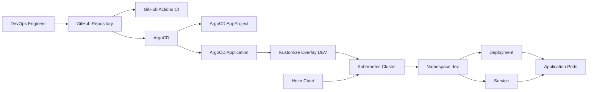

# Arquitetura — GitOps ArgoCD Kubernetes

## Visão geral

Este projeto demonstra uma implementação GitOps utilizando ArgoCD, Kubernetes, Kustomize, Helm e GitHub Actions.

A proposta é manter o Git como fonte única da verdade para o estado desejado das aplicações Kubernetes.

O ArgoCD monitora continuamente o repositório e compara o estado definido no Git com o estado real do cluster.

Quando existe divergência, o ArgoCD pode sincronizar automaticamente os recursos.

---

## Objetivos

A arquitetura foi criada para demonstrar:

- GitOps;
- Continuous Delivery;
- Kubernetes;
- ArgoCD;
- Kustomize;
- Helm;
- configuração declarativa;
- reconciliação contínua;
- self-healing;
- pruning de recursos;
- separação por ambientes;
- validação automatizada com GitHub Actions.

---

## Arquitetura



---

## Fluxo GitOps

O fluxo principal do projeto é:

```text
Desenvolvedor
      |
      v
Git Commit / Push
      |
      v
GitHub Repository
      |
      +----------------+
      |                |
      v                v
GitHub Actions       ArgoCD
      |                |
      v                v
Validação        Detecta mudança
                       |
                       v
                   Sync
                       |
                       v
               Kubernetes Cluster
```

O Git funciona como fonte única da verdade.

Nenhuma alteração permanente no ambiente Kubernetes deve depender de configuração manual diretamente no cluster.

---

## Estrutura do projeto

```text
gitops-argocd-kubernetes/
├── .github/
│   └── workflows/
│       └── ci.yml
│
├── argocd/
│   ├── applications/
│   │   └── demo-app.yaml
│   └── projects/
│       └── dev-project.yaml
│
├── apps/
│   └── demo/
│       ├── base/
│       │   ├── deployment.yaml
│       │   ├── service.yaml
│       │   └── kustomization.yaml
│       │
│       └── overlays/
│           └── dev/
│               └── kustomization.yaml
│
├── helm/
│   └── demo/
│       ├── templates/
│       │   ├── deployment.yaml
│       │   └── service.yaml
│       ├── Chart.yaml
│       └── values.yaml
│
├── docs/
│   └── architecture.md
│
├── .gitignore
├── Makefile
└── README.md
```

---

## Aplicação Kubernetes

A aplicação de demonstração utiliza:

```text
nginx:1.27-alpine
```

O Deployment possui:

- duas réplicas;
- readiness probe;
- liveness probe;
- requests de CPU e memória;
- limits de CPU e memória.

O Service utiliza:

```text
ClusterIP
```

mantendo a aplicação disponível internamente no cluster.

---

## Kustomize

O projeto utiliza Kustomize para separar configuração base das configurações específicas de ambiente.

Estrutura:

```text
apps/demo/
├── base/
└── overlays/
    └── dev/
```

---

## Base

A base contém os recursos comuns:

```text
deployment.yaml
service.yaml
kustomization.yaml
```

Esses arquivos representam o estado padrão da aplicação.

---

## Overlay DEV

O overlay de desenvolvimento está em:

```text
apps/demo/overlays/dev/
```

Ele referencia a base e adiciona configurações específicas do ambiente.

Entre elas:

```text
namespace: dev
namePrefix: dev-
environment: dev
```

Esse modelo permite criar posteriormente:

```text
overlays/
├── dev/
├── hml/
└── prod/
```

sem duplicar os manifests principais.

---

## Helm

Além de Kustomize, o projeto também demonstra empacotamento Kubernetes utilizando Helm.

Estrutura:

```text
helm/demo/
├── templates/
│   ├── deployment.yaml
│   └── service.yaml
├── Chart.yaml
└── values.yaml
```

O arquivo:

```text
values.yaml
```

centraliza valores como:

- quantidade de réplicas;
- imagem;
- tag;
- configuração do Service;
- recursos;
- probes;
- labels.

---

## ArgoCD AppProject

O recurso:

```text
argocd/projects/dev-project.yaml
```

define o projeto lógico utilizado pelo ArgoCD.

Ele controla:

- repositórios permitidos;
- destinos permitidos;
- namespace permitido;
- tipos de recursos permitidos.

O repositório autorizado é:

```text
https://github.com/Pbarbosa4410/gitops-argocd-kubernetes.git
```

O destino configurado é:

```text
server: https://kubernetes.default.svc
namespace: dev
```

---

## ArgoCD Application

O recurso:

```text
argocd/applications/demo-app.yaml
```

define a aplicação monitorada pelo ArgoCD.

A origem é:

```text
apps/demo/overlays/dev
```

A branch monitorada é:

```text
main
```

O destino é:

```text
namespace: dev
```

---

## Sincronização automática

A Application utiliza:

```yaml
syncPolicy:
  automated:
    prune: true
    selfHeal: true
```

---

## Self-healing

Com:

```text
selfHeal: true
```

o ArgoCD pode detectar divergências entre o Git e o cluster.

Exemplo:

O Git define:

```text
replicas: 2
```

Se alguém alterar manualmente no cluster para:

```text
replicas: 5
```

o ArgoCD detectará o drift e poderá restaurar o estado definido no Git.

---

## Prune

Com:

```text
prune: true
```

recursos removidos do Git também podem ser removidos do cluster durante a sincronização.

Isso evita a existência de recursos órfãos que não fazem mais parte da configuração declarativa.

---

## CreateNamespace

A configuração:

```text
CreateNamespace=true
```

permite que o ArgoCD crie o namespace de destino caso ele ainda não exista.

Neste projeto:

```text
dev
```

---

## Reconciliação

O princípio central do GitOps é a reconciliação contínua.

O ArgoCD compara:

```text
Desired State
      |
      | Git
      v
----------------
   comparação
----------------
      ^
      | Cluster
      |
Actual State
```

Se os estados forem diferentes, ocorre uma situação de:

```text
OutOfSync
```

Após sincronização bem-sucedida:

```text
Synced
```

---

## GitHub Actions

O pipeline está localizado em:

```text
.github/workflows/ci.yml
```

O CI possui validações independentes para:

- Kustomize;
- Helm;
- manifests ArgoCD.

---

## Validação Kustomize

O pipeline executa:

```bash
kubectl kustomize apps/demo/base
```

e:

```bash
kubectl kustomize apps/demo/overlays/dev
```

Isso garante que os manifests possam ser renderizados corretamente.

---

## Validação Helm

O pipeline executa:

```bash
helm lint helm/demo
```

e:

```bash
helm template demo helm/demo
```

O `helm lint` valida a estrutura do Chart.

O `helm template` renderiza os templates localmente sem necessidade de instalar recursos em um cluster.

---

## Validação ArgoCD

Os manifests do ArgoCD são avaliados com:

```bash
kubectl apply --dry-run=client --validate=false
```

Isso permite uma verificação básica da estrutura sem necessidade de conexão com um cluster ArgoCD real.

---

## Fluxo de alteração

Exemplo de alteração de escala:

Estado inicial:

```yaml
replicas: 2
```

O desenvolvedor altera para:

```yaml
replicas: 3
```

Fluxo:

```text
Alteração
   |
git commit
   |
git push
   |
GitHub
   |
GitHub Actions
   |
ArgoCD detecta nova revisão
   |
Sync
   |
Deployment atualizado
   |
3 réplicas
```

---

## Separação entre CI e CD

Este projeto separa claramente CI de CD.

### CI

Responsabilidade do GitHub Actions:

```text
Validar código
Validar Kustomize
Validar Helm
Validar manifests ArgoCD
```

### CD

Responsabilidade do ArgoCD:

```text
Monitorar Git
Comparar estado
Sincronizar cluster
Corrigir drift
Remover recursos obsoletos
```

O GitHub Actions não precisa executar:

```text
kubectl apply
```

para realizar o deploy da aplicação no modelo GitOps.

---

## Segurança

Algumas práticas utilizadas:

- nenhuma credencial Kubernetes no Git;
- nenhum token ArgoCD versionado;
- kubeconfig ignorado;
- arquivos de chave ignorados;
- repositório explicitamente permitido no AppProject;
- destino do ArgoCD limitado ao namespace esperado;
- alterações passam por controle de versão.

---

## Vantagens do modelo GitOps

Entre as principais vantagens:

- rastreabilidade;
- auditoria;
- rollback por Git;
- estado declarativo;
- menor dependência de acesso manual ao cluster;
- redução de configuração divergente;
- automação de deploy;
- detecção de drift;
- recuperação automática.

---

## Evoluções possíveis

O projeto pode evoluir com:

- múltiplos ambientes;
- ArgoCD ApplicationSet;
- App of Apps;
- Argo Rollouts;
- progressive delivery;
- canary deployment;
- blue/green deployment;
- sealed secrets;
- External Secrets;
- HashiCorp Vault;
- Helm repositories;
- private container registry;
- Image Updater;
- notifications;
- Prometheus;
- Grafana;
- integração com Amazon EKS.